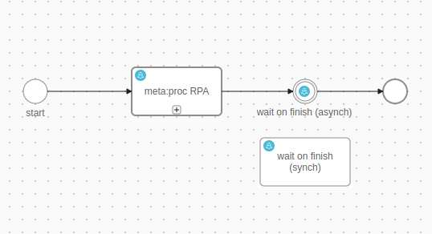

# Axon Ivy RPA

The Axon Ivy RPA (Robotic Process Automation) built-in module ushers you into a realm of unparalleled operational excellence.
It stands as your organization's clandestine key to unlocking remarkable efficiency and unwavering precision.
Seamlessly woven into your current systems, Axon Ivy RPA functions akin to an indefatigable digital
workforce always within reach. This integration offers:

- A foundation rooted in the meta:proc suite from meta:proc ([https://www.metaproc.com/en/](https://www.metaproc.com/en/)).
- Streamlined automation of manual tasks across diverse systems, eliminating the necessity for pre-existing APIs.
- Accessible via an additional, paid license key.
- Equipped with an effortlessly replicable demo implementation, significantly curtailing integration endeavors.

## Demo

The demo process is executing the RPA and is waiting on the result.



## Setup

Add the following `Variables` to your `variables.yaml`:

- `Variables.metaproc.Url`
- `Variables.metaproc.Username`
- `Variables.metaproc.Password`

and replace the values with your given setup.

```
@variables.yaml@
```
